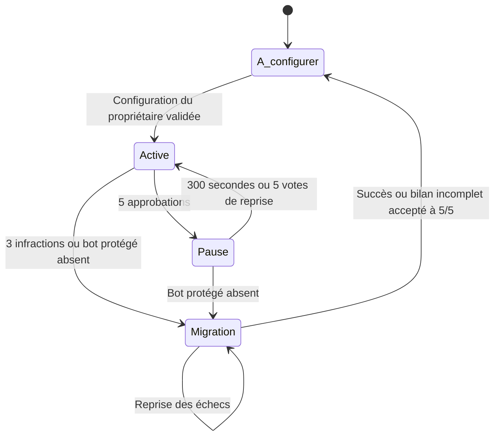

# Sentinelle — surveillance collective du propriétaire Discord

Bot Python pour une communauté, un serveur principal et un serveur de secours.
Le bot du coffre n'est pas implémenté ici : Sentinelle surveille seulement sa présence.

## Fonctionnement

- À l'installation : état `unconfigured`, aucune infraction ni migration automatique.
- Le propriétaire initialise les serveurs, le rôle du conseil, les cinq personnes et le gardien.
- Après activation : chaque action du propriétaire présente dans les journaux d'audit Discord compte
  comme une infraction. Les actions des autres personnes/bots ne comptent pas.
- Trois infractions déclenchent une migration OAuth2. Aucun salon n'est supprimé.
- L'expulsion, le bannissement ou l'absence confirmée d'un bot protégé déclenche directement la
  migration, même pendant une pause et même si l'auteur n'est pas identifiable. Un seul incident
  est créé, sans double comptage audit/événement Gateway.
- Les cinq conseillers peuvent voter une pause de 300 secondes, une remise à zéro, une reprise
  anticipée du comptage ou une modification de configuration. Le demandeur vote lui aussi.
- Les actions du propriétaire restent journalisées pendant la pause. La fin de pause survit aux
  redémarrages. Le compteur n'est pas remis à zéro par une pause.
- Les cinq identités enregistrées déterminent les droits de vote. Une attribution de rôle manuelle
  ne donne pas de sixième voix. Le bot tente de restaurer la composition du rôle.
- Une migration terminée met le secours en attente de configuration par son propriétaire,
  conformément à la règle retenue. L'ancien historique est conservé.



## Installation

Python 3.11+ est nécessaire.

```sh
python -m venv .venv
# Windows PowerShell : .\.venv\Scripts\Activate.ps1
# Linux/macOS : source .venv/bin/activate
python -m pip install -r requirements.txt
```

1. Appliquer `supabase/migrations/20261003000000_sentinel_v2.sql` avec un compte administrateur
   de la base Supabase. Elle peut être appliquée seule sur une nouvelle base, ou après l'ancien schéma.
2. Copier `.env.example` vers `.env` et remplir les secrets. Ne pas écraser un `.env` existant.
3. Générer `TOKEN_ENCRYPTION_KEY` avec la commande indiquée dans `.env.example` et la sauvegarder.
4. Configurer HTTPS et l'URL OAuth2 `/callback`, pour la même application Discord que Sentinelle.
5. Activer les intents **Server Members** et **Message Content** dans le portail Discord.
6. Installer le bot sur les deux serveurs, régler ses permissions puis lancer `python run.py`.

Les anciens IDs présents dans `.env` ne configurent plus le bot. Une configuration Discord est nécessaire.
Les jetons de l'ancien schéma ne sont pas importés automatiquement : ils ne contiennent pas de preuve
de consentement pour une destination précise. Les membres doivent utiliser le nouveau parcours.

## Commandes

Première configuration par le propriétaire, depuis le serveur principal :

```text
!configurer SECOURS_ID GARDIEN_ID ROLE_CONSEIL_ID ID1,ID2,ID3,ID4,ID5 [SALON_ID] [SALON_SECOURS_ID]
```

Les IDs des personnes sont séparés par des virgules sans espace. Les deux derniers arguments sont
facultatifs ; `0` choisit automatiquement le premier salon valable. Le bot affiche les salons retenus.
Les propriétaires et l'identité de Sentinelle sont découverts automatiquement.

| Commande | Effet |
| --- | --- |
| `!aide`, `!statut` | Aide, état de la surveillance, propriétaires, compteur et pause |
| `!configurer ...` | Initialisation par le propriétaire ; après activation, proposition par un conseiller |
| `!pause` | Propose une pause de cinq minutes du comptage uniquement |
| `!reset` | Propose de remettre le compteur à zéro sans effacer l'historique |
| `!reactiver` | Propose une fin de pause anticipée |
| `!approuver ID` ou `!approve ID` | Enregistre une des cinq approbations distinctes |
| `!infractions` | Affiche les dix derniers événements du journal aux conseillers |
| `!maintenance` | Lance une synchronisation/maintenance, réservée au conseil |
| `!inscription` | Publie un bouton de consentement à l'ajout au secours désigné |
| `!moninscription` | Vérifie l'autorisation du membre pour la destination courante |
| `!retirer` | Retire cette autorisation locale et efface ses jetons locaux |
| `!reprendre` | Un conseiller relance les ajouts échoués, vers la même destination |
| `!finaliser` | Vote à cinq pour accepter un bilan incomplet et permettre la reconfiguration |

Une demande expire après dix minutes. Elle n'est jamais réutilisable après exécution.
Une modification du conseil invalide les votes portant sur sa composition précédente.

## Tests

```sh
python -B -m unittest -v
```

Les tests n'utilisent ni votre `.env`, ni Discord, ni Supabase en production. Ils testent les règles
réelles et le callback HTTP local avec des adaptateurs simulés. Ils ne remplacent pas une recette sur
deux serveurs Discord de test et une base Supabase dédiée.

Voir [GUIDE.md](GUIDE.md) pour le déploiement et la recette, et [CHANGES.md](CHANGES.md) pour les modifications.
